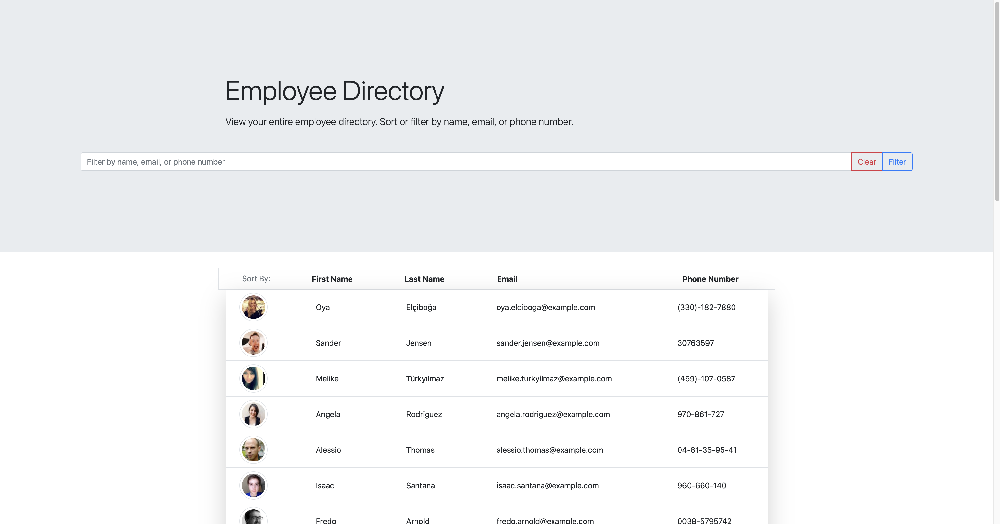

# Employee Directory

> This Web Application allows the user to view an entire employee directory all at once. User can also sort or filter employees.

### Table of Contents

- [Description](#description)
- [Installation](#installation)
- [Technologies](#technologies)
- [How To Use](#how-to-use)
- [Links](#links)
- [Author Info](#author-info)

---

## Description
This project uses the randomuser api to return 30 employees on the seen. Using React.js, I was able to display the filtered data, incorporate filter and sort features, and make this application mobile responsive.

---

## Installation
There are no requirements to run this App.

---
[Back To The Top](#read-me-template)

## Technologies
React.js, JavaScript, CSS, HTML, Node.js, npm packages

[Back To The Top](#read-me-template)

---

## How To Use
Search for a person by first or last name, email, or phone number in the provided search bar. Sort by first or last name, email, and phone number by clicking on the column. A new set of employees will be listed on every screen refresh. 
   
   [Back To The Top](#read-me-template)
   
---

## Links

Link to site:
https://deleonfrancis.github.io/Employee_Directory/

Link to GitHub repository:
https://github.com/deleonfrancis/Employee_Directory

[Back To The Top](#read-me-template)

---

## Author Info

- E-mail: dxfrancis.coding@gmail.com

[Back To The Top](#read-me-template)

---

## License

MIT
Copyright (c) 2021 Deleon Francis

Permission is hereby granted, free of charge, to any person obtaining a copy
of this software and associated documentation files (the "Software"), to deal
in the Software without restriction, including without limitation the rights
to use, copy, modify, merge, publish, distribute, sublicense, and/or sell
copies of the Software, and to permit persons to whom the Software is
furnished to do so, subject to the following conditions:

The above copyright notice and this permission notice shall be included in all
copies or substantial portions of the Software.

THE SOFTWARE IS PROVIDED "AS IS", WITHOUT WARRANTY OF ANY KIND, EXPRESS OR
IMPLIED, INCLUDING BUT NOT LIMITED TO THE WARRANTIES OF MERCHANTABILITY,
FITNESS FOR A PARTICULAR PURPOSE AND NONINFRINGEMENT. IN NO EVENT SHALL THE
AUTHORS OR COPYRIGHT HOLDERS BE LIABLE FOR ANY CLAIM, DAMAGES OR OTHER
LIABILITY, WHETHER IN AN ACTION OF CONTRACT, TORT OR OTHERWISE, ARISING FROM,
OUT OF OR IN CONNECTION WITH THE SOFTWARE OR THE USE OR OTHER DEALINGS IN THE
SOFTWARE.
